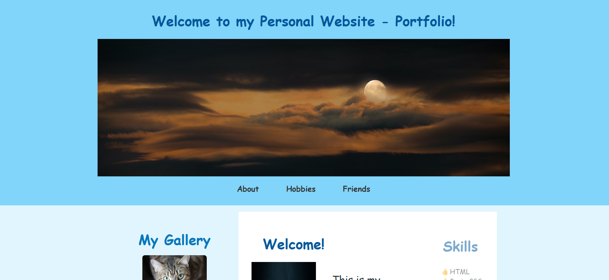
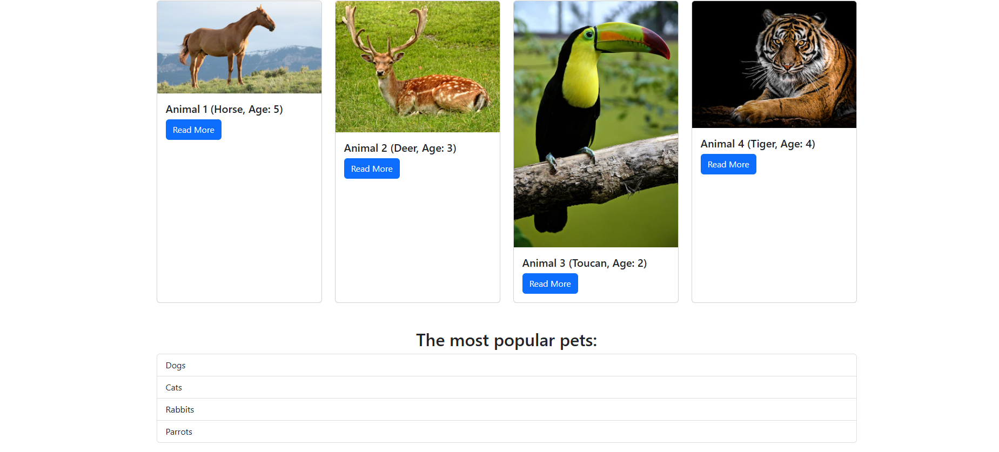

# 🚀 Ampli Beginner Portfolio

Hi all! 👋 I'm a beginner web developer, and I'm glad to welcome you to my portfolio! Here, you will find my projects and skills. Let's explore together! 😊

---

## 🛠 My Skills

✅ Web development
✅ Responsive and Adaptive layout
✅ Debugging & Optimization

---

## 📚 Technologies I Use

- **HTML, CSS, JavaScript**
- **Bootstrap**
- **jQuery**
- **Git & GitHub**

---

## 💼 My Projects

### 🌐 Personal Web Site
📌 A showcase of my work and experience.  
🔗 [Visit Project](https://zen1th132.github.io/portfolio/portfolio)  

---

### 🐶 Pet Store
📌 A simple online pet store website.  
🔗 [Visit Project](https://zen1th132.github.io/portfolio/pet_store)  

---

### 🚀Galactic Shield Web Game
📌 A fun and interactive space shooter game.  
🔗 [Play Now](https://zen1th132.github.io/galactic_shield/)  

---

## ⭐ Thanks for Visiting!

If you like my work, feel free to give it a ⭐ on GitHub!

📫 **Contact me:**  
📧 Email: [your email]  
🔗 LinkedIn: [your profile]  
📂 GitHub: [your GitHub]

Happy Coding! 🚀

